# Smart Static Website: The Self-Aware Product Launch Page

This project demonstrates a modern, secure, and cost-effective cloud architecture for hosting a high-performance static website. The example site is for a fictional product launch ("Aether Drone") and features a **live technical dashboard** that showcases the underlying cloud infrastructure in real-time.

**Note**: The infrastructure for this project is managed entirely with Terraform. To see it in action, you must deploy it to your own AWS account using the instructions below.

---

## The Business Problem & The Cloud Solution

This project was designed to solve three common business challenges for any public-facing website:

1. **Problem: High User Bounce Rates.** Users leave if a site takes more than a second to load.
    * **Solution:** The site is deployed globally on **AWS CloudFront's** edge network, ensuring sub-second load times for visitors anywhere in the world.

2. **Problem: Constant Security Threats.** Malicious bots and bad actors are a constant threat to availability.
    * **Solution:** An **AWS WAF (Web Application Firewall)** is deployed in front of the site, using managed and custom rules to block common web exploits and malicious traffic patterns before they reach the application.

3. **Problem: Managing Budgets.** Traditional hosting requires paying for idle servers, which is inefficient.
    * **Solution:** The entire architecture is **serverless**. The website is hosted on **AWS S3**, and the backend logic runs on-demand in **AWS Lambda**. This pay-per-use model means costs are near-zero at low traffic and scale elegantly, eliminating the need for expensive, over-provisioned servers.

---

## Key Features: The "Self-Aware" Dashboard

The website includes a "Live Technical Insights" dashboard that makes the invisible cloud infrastructure visible to the end-user. This is powered by a serverless backend using AWS Lambda and API Gateway.

* **Live Visitor Location:** Detects the visitor's city and country.
* **Live Edge Server ID:** Shows the specific CloudFront edge server ID that is delivering the content.
* **Live Threat Counter:** Displays a real-time count of malicious requests blocked by the WAF in the last hour.
* **Interactive Security Test:** A button allows any user to attempt a mock XSS attack, which is blocked by the WAF, demonstrating the security in real-time as the counter increments.

---

## Architectural Diagram

```mermaid
flowchart LR
    subgraph "User"
        A[End User 🧑]
    end

    subgraph "CDN & Security Layer"
        B[AWS WAF 🔒]
        C[CloudFront 🚀]
    end

    subgraph "Static Frontend Origin"
        D[S3 Bucket 🗃️]
    end

    subgraph "Serverless API Backend"
        E[API Gateway 🔗]
        F[getVisitorLocation<br>Lambda 🐑]
        G[getWafBlockCount<br>Lambda 🐑]
        H[CloudWatch Logs 📊]
    end

    A -->|"HTTPS Request"| B
    B -->|"Filtered Traffic"| C

    C -->|"Default: <br>(static site)"| D
    C -->|"API: <br>/default/*, /waf"| E

    E -->|"GET /default/getVisitorLocation"| F
    E -->|"GET /waf"| G
    G -.->|"Reads WAF Logs"| H

    %% Style customizations
    style D fill:#FFFBCC,stroke:#333,stroke-width:2px
    style F fill:#D6EAF8,stroke:#333,stroke-width:2px
    style G fill:#D6EAF8,stroke:#333,stroke-width:2px
```

---

## Technology Stack

### Frontend

* **Next.js:** A React framework for building fast, modern web applications.
* **Tailwind CSS:** A utility-first CSS framework for rapid UI development.
* **TypeScript:** For static typing and improved code quality.

### Infrastructure as Code (IaC)

* **Terraform**: For defining and managing all AWS cloud resources in a repeatable and automated way.

### Cloud Infrastructure (AWS)

* **S3:** For scalable, secure object storage of the static website files.
* **CloudFront:** A global Content Delivery Network (CDN) for low-latency delivery and caching.
* **WAF & Shield:** For protection against common web exploits and DDoS attacks.
* **Lambda:** For running serverless, on-demand backend code without managing servers.
* **API Gateway:** To create, publish, and secure APIs for the Lambda functions.
* **CloudWatch:** For logging, monitoring, and querying application and infrastructure metrics.
* **IAM:** For securely managing access and permissions between AWS services.

### CI/CD

* **Git & GitHub:** For version control and source code management.
* **GitHub Actions:** For creating a CI/CD pipeline that builds the frontend application and syncs the static files to the S3 bucket upon deployment.

---

## Setup and Deployment

This project uses a hybrid deployment model: AWS infrastructure is provisioned with Terraform first, and then the frontend application is deployed via the existing GitHub Actions workflow.

1. **Deploy the AWS Infrastructure with Terraform**

    All AWS resources (S3, CloudFront, Lambda, etc.) are defined in the ``/terraform`` directory.

   For detailed, step-by-step instructions on how to deploy the infrastructure, please see the ``README`` inside the terraform directory: [terraform/README.md](./terraform/README.md)

   After a successful ``terraform apply``, Terraform will display output values for ``s3_bucket_name`` and ``cloudfront_distribution_id``. You will need these values for the next step.

2. **Configure GitHub Actions for Frontend Deployment**

    The GitHub Actions workflow in .github/workflows/deploy.yml automatically builds and syncs your Next.js application to the S3 bucket created by Terraform. To enable this, you must configure the following secrets in your GitHub repository's settings (Settings > Secrets and variables > Actions):

    * ``AWS_ACCESS_KEY_ID``: Your AWS access key.

    * ``AWS_SECRET_ACCESS_KEY``: Your AWS secret key.

    * ``AWS_S3_BUCKET``: The s3_bucket_name value from the Terraform output.

    * ``AWS_CLOUDFRONT_DISTRIBUTION_ID``: The cloudfront_distribution_id value from the Terraform output.

3. **Trigger the Frontend Deployment**

    Once the secrets are configured, any git push to the main branch will automatically trigger the GitHub Action. It will build your Next.js application, sync the static files to the S3 bucket, and invalidate the CloudFront cache to make your changes live.

4. **Destroying the Infrastructure**

    To tear down all the AWS resources and stop incurring costs, simply run the destroy command from within the terraform directory:

    ```bash
    terraform destroy
    ```

## Author

**Jules Bahanyi** - [GitHub](https://github.com/jujubear24]) - [LinkedIn](https://www.linkedin.com/in/jules-bahanyi/)
