# Smart Static Website: The Self-Aware Product Launch Page

This project demonstrates a modern, secure, and cost-effective cloud architecture for hosting a high-performance static website. The example site is for a fictional product launch ("Aether Drone") and features a **live technical dashboard** that showcases the underlying cloud infrastructure in real-time.

**Live Demo:** [**d1i0kf3pazdka3.cloudfront.net**](https://d1i0kf3pazdka3.cloudfront.net/) 🚀

---

## The Business Problem & The Cloud Solution

This project was designed to solve three common business challenges for any public-facing website:

1. **Problem: High User Bounce Rates.** Users leave if a site takes more than a second to load.
    * **Solution:** The site is deployed globally on **AWS CloudFront's** edge network, ensuring sub-second load times for visitors anywhere in the world.

2. **Problem: Constant Security Threats.** Malicious bots and bad actors are a constant threat to availability.
    * **Solution:** An **AWS WAF (Web Application Firewall)** is deployed in front of the site, using managed and custom rules to block common web exploits and malicious traffic patterns before they reach the application.

3. **Problem: Managing Budgets.** Traditional hosting requires paying for idle servers, which is inefficient.
    * **Solution:** The entire architecture is **serverless**. The website is hosted on **AWS S3**, and the backend logic runs on-demand in **AWS Lambda**. This pay-per-use model means costs are near-zero at low traffic and scale elegantly, eliminating the need for expensive, over-provisioned servers.

---

## Key Features: The "Self-Aware" Dashboard

The website includes a "Live Technical Insights" dashboard that makes the invisible cloud infrastructure visible to the end-user. This is powered by a serverless backend using AWS Lambda and API Gateway.

* **Live Visitor Location:** Detects the visitor's city and country.
* **Live Edge Server ID:** Shows the specific CloudFront edge server ID that is delivering the content.
* **Live Threat Counter:** Displays a real-time count of malicious requests blocked by the WAF in the last hour.
* **Interactive Security Test:** A button allows any user to attempt a mock XSS attack, which is blocked by the WAF, demonstrating the security in real-time as the counter increments.

---

## Architectural Diagram

```mermaid
flowchart LR
    subgraph "User"
        A[End User 🧑]
    end

    subgraph "CDN & Security Layer"
        B[AWS WAF 🔒]
        C[CloudFront 🚀]
    end

    subgraph "Static Frontend Origin"
        D[S3 Bucket 🗃️]
    end

    subgraph "Serverless API Backend"
        E[API Gateway 🔗]
        F[getVisitorLocation<br>Lambda 🐑]
        G[getWafBlockCount<br>Lambda 🐑]
        H[CloudWatch Logs 📊]
    end

    A -->|"HTTPS Request"| B
    B -->|"Filtered Traffic"| C

    C -->|"Default: <br>(static site)"| D
    C -->|"API: <br>/default/*, /waf"| E

    E -->|"GET /default/getVisitorLocation"| F
    E -->|"GET /waf"| G
    G -.->|"Reads WAF Logs"| H

    %% Style customizations
    style D fill:#FFFBCC,stroke:#333,stroke-width:2px
    style F fill:#D6EAF8,stroke:#333,stroke-width:2px
    style G fill:#D6EAF8,stroke:#333,stroke-width:2px
```

---

## Technology Stack

### Frontend

* **Next.js:** A React framework for building fast, modern web applications.
* **Tailwind CSS:** A utility-first CSS framework for rapid UI development.
* **TypeScript:** For static typing and improved code quality.

### Cloud Infrastructure (AWS)

* **S3:** For scalable, secure object storage of the static website files.
* **CloudFront:** A global Content Delivery Network (CDN) for low-latency delivery and caching.
* **WAF & Shield:** For protection against common web exploits and DDoS attacks.
* **Certificate Manager (ACM):** For providing free and auto-renewing SSL/TLS certificates.
* **Lambda:** For running serverless, on-demand backend code without managing servers.
* **API Gateway:** To create, publish, and secure APIs for the Lambda functions.
* **CloudWatch:** For logging, monitoring, and querying application and infrastructure metrics.
* **IAM:** For securely managing access and permissions between AWS services.

### CI/CD

* **Git & GitHub:** For version control and source code management.
* **GitHub Actions:** For creating a fully automated CI/CD pipeline that builds and deploys the application on every push to the `main` branch.

---

## Setup and Deployment

This project is configured for fully automated deployment.

1. **Prerequisites:** An AWS account and a GitHub repository.
2. **Configuration:** The GitHub Actions workflow (`.github/workflows/deploy.yml`) requires the following secrets to be set in the repository's settings:
    * `AWS_ACCESS_KEY_ID`
    * `AWS_SECRET_ACCESS_KEY`
    * `AWS_S3_BUCKET`
    * `AWS_CLOUDFRONT_DISTRIBUTION_ID`
3. **Deployment:** Any `git push` to the `main` branch will automatically trigger the GitHub Action, which builds the Next.js application, syncs the files to S3, and creates a CloudFront invalidation to publish the changes.

## Author

**Jules Bahanyi** - [https://github.com/jujubear24] - [https://www.linkedin.com/in/jules-bahanyi/]
